# SDC Time Tracker: User Manual

Welcome to the comprehensive user manual for the SDC Time Tracker. This guide is divided into two main sections: **Employee Workflows** for logging time and absences, and **Manager workflows** for administration, system configuration, approvals, and reporting.

---

## Part 1: Employee Workflows

### 1.1 Smart List & Quick Actions
To minimize scrolling, the login list uses a **Smart Sorting Algorithm**. Employees are dynamically sorted into tiers based on their current status:
- **Not started today:** Sorted by their historical average check-in time (e.g., usually arrives at 08:00).
- **Currently checked in:** Sorted by when they punched in today.
- **Checked out for the day:** Sorted by check-out time.
- Leaves and Supervisors remain at the bottom.

*(You can disable this and sort alphabetically by toggling the **A→Z** switch at the top of the list).*

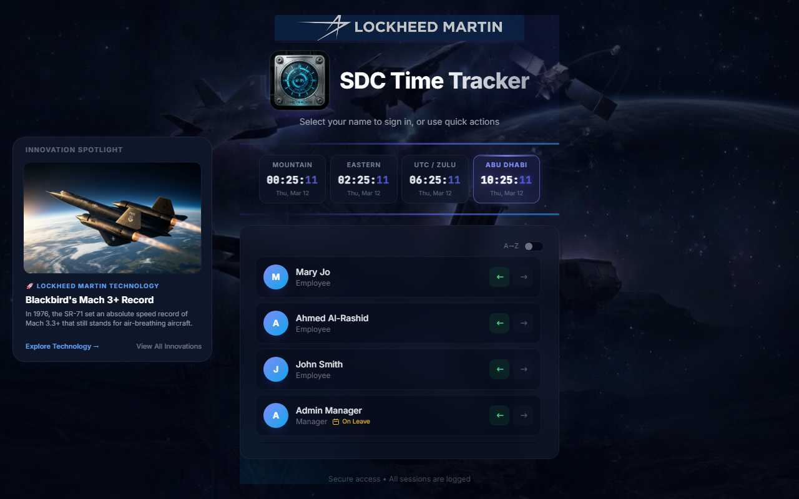

If you just need to punch in or out without viewing your dashboard, you can use the **Quick Actions** directly from this main login screen.
1. Locate your name on the login list.
2. Click the **green Check-In arrow** or the **red Check-Out arrow** next to your name.
3. Enter your 4-digit PIN in the modal that pops up to confirm your action.

> [!NOTE]
> **Time Rounding Policy:** Quick Check-In punches are automatically rounded *down* to the nearest 5-minute mark (e.g., 08:04 becomes 08:00). Quick Check-Out punches are automatically rounded *up* to the nearest 5-minute mark (e.g., 17:01 becomes 17:05).

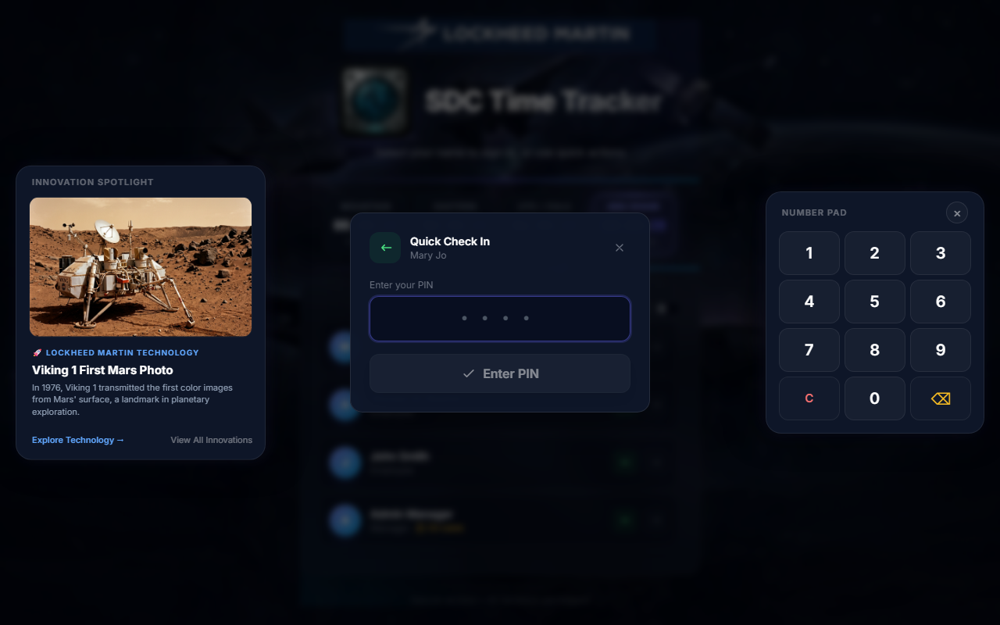

### 1.2 Dashboard: Alternative Check-In/Out Times & Mandatory Comments
Sometimes you may forget to punch in or out at the exact time you arrived or left. You can adjust the time directly when punching in or out via the Dashboard.

1. Log into your dashboard by clicking your name.
2. Click the large **Check In** or **Check Out** buttons.
3. You will be presented with a time selector. If the time you select differs from the current time beyond the system's threshold (typically 30 minutes), **you are required to enter a comment** explaining the discrepancy.
4. Provide the comment and submit. 

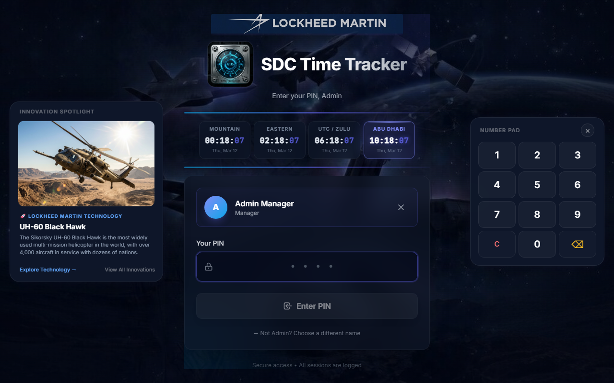

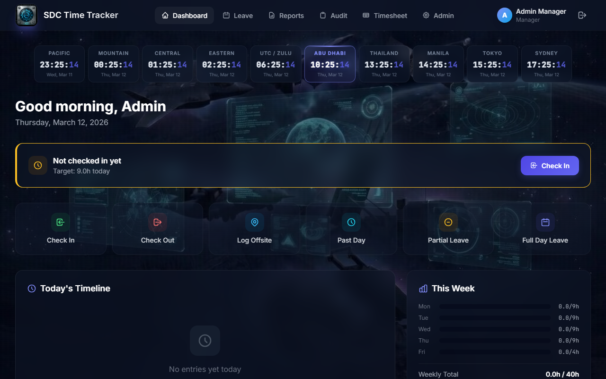
*(Top: Main dashboard panel)*

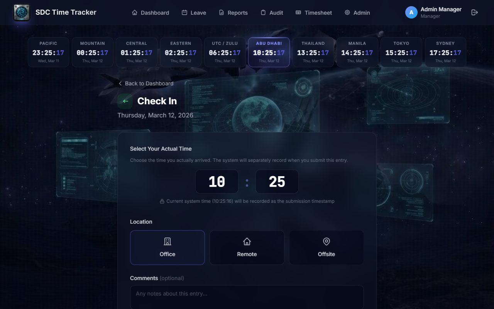
*(Above: The check-in form requiring comments for alternative times)*

### 1.3 Changing a Past Day's Time
If you need to correct a timesheet for a previous day entirely (e.g., you forgot to check out yesterday):
1. Navigate to the **Past Day** entry page via the sidebar menu.
2. Select the date from the dropdown that you need to adjust.
3. Provide your exact Check-In time, Check-Out time, and any Lunch/Offsite details.
4. **Important:** All past-day modifications require a mandatory comment, and the system actively tracks these historical modifications in the audit logs.

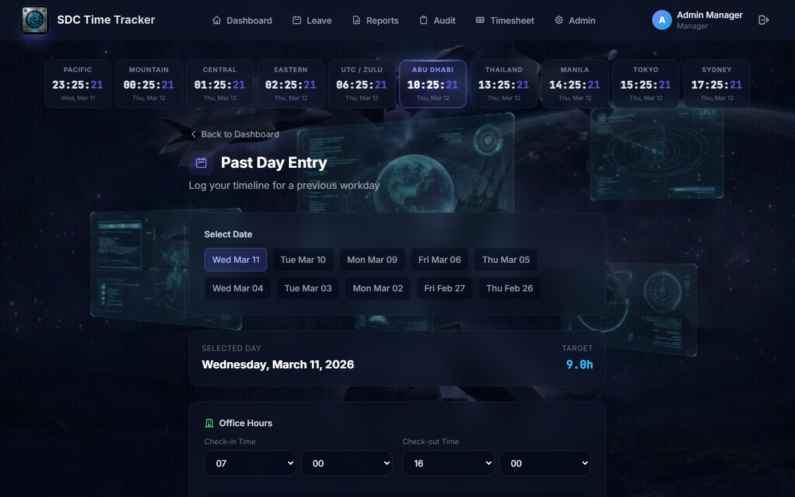

### 1.4 Entering Offsite Work
For employees working away from the primary office or their authorized remote location (e.g., a client site visit):
1. Go to the **Offsite Work** tab.
2. Enter the Location (Client Name, Facility, etc.).
3. Input the exact start and end times you were working there.
4. Submit the entry. Offsite hours will automatically contribute to your overall compliant hours for the day once logged.

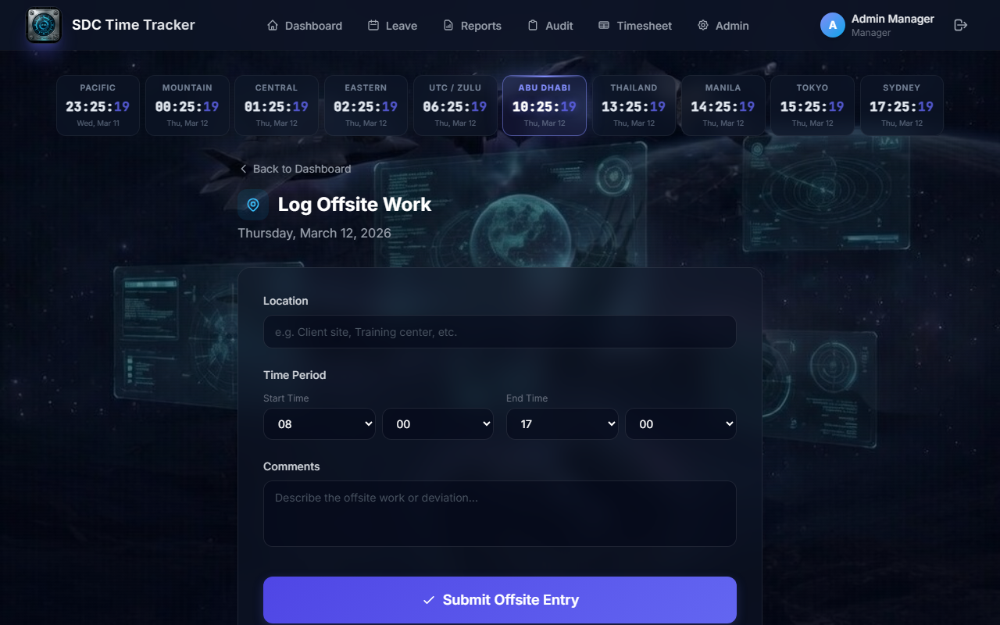

### 1.5 Entering PTO (Paid Time Off)
You can log expected absences via the Leave pages.
- **Full Day Leave:** Use the primary **Leave** tab to request full days off. Select "Vacation" or "Sick", enter the start/end dates, and submit it for manager approval.
- **Partial Leave:** If you are only taking a few hours off during a single workday, use the **Partial Leave** tab. This allows you to allocate exactly how many hours of your daily target are assigned to PTO, helping you remain compliant for that day's target hours.

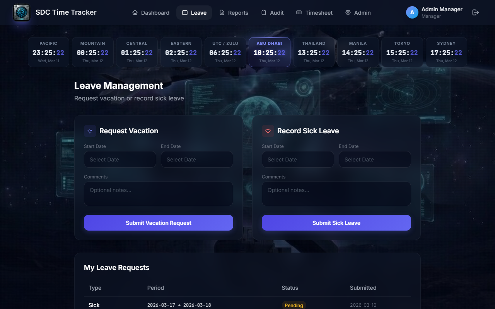
*(Above: Full Day Leave Request)*

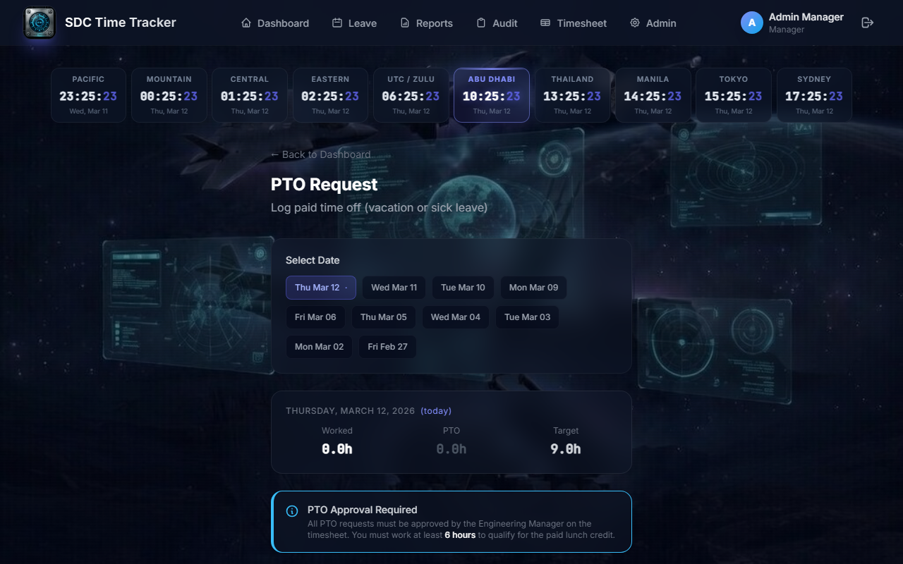
*(Above: Partial Leave Request)*

### 1.6 Automated Email Notifications
The system automatically sends confirmation and reminder emails to keep you informed of your status.
- **Check-In Confirmations:** Every time you punch in (via Quick Action or Dashboard), you will receive an email confirming your start time and providing your **Expected Checkout Time** based on your daily target hours.
- **Checkout Reminders:** If enabled by your manager, you will receive a reminder email shortly before your expected checkout time to ensure you don't forget to punch out.
- **Innovation Spotlight:** Each email features a "Lockheed Martin Innovation Spotlight," showcasing advanced technologies and historical milestones from across the company.

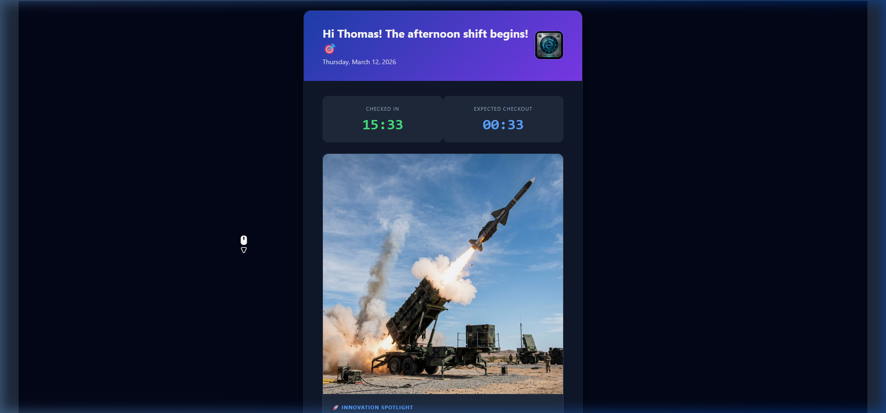

---

## Part 2: Manager & Admin Workflows

*Note: The following pages are only accessible to accounts holding the "Supervisor" or "Manager" roles.*

### 2.1 The Admin Section (Manage Users)
The main **Admin Control Panel** is where you manage your employee roster and their authorizations.
- **Add/Edit Users:** You can create new users, modify their roles, or trigger a PIN reset for them.
- **Remote Authorizations:** You can authorize specific employees for remote work on specific dates from this panel. 

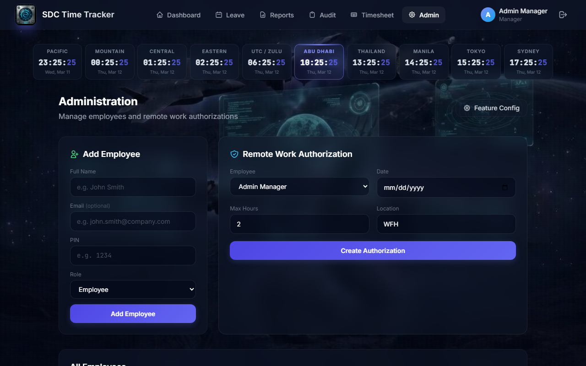

### 2.2 System Configurations
Managers have access to the **System Configuration** page to toggle application-wide features safely. Here you can configure:
- Automated Warning Emails (e.g., if an employee forgets to check out)
- Policy Alert Thresholds (e.g., requiring comments if time differs by X minutes)
- UI element toggling (e.g., hiding innovations panel).

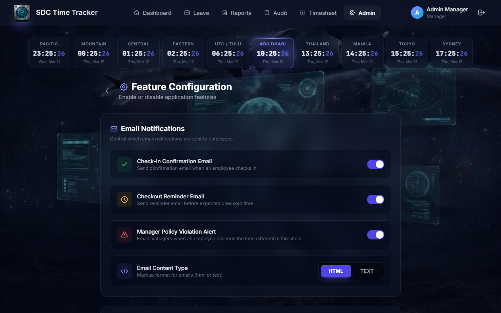

### 2.3 Timesheets & Approvals
The **Manager Timesheet** is your primary dashboard for tracking team compliance over a given week.
- You can see punctuality indicators (Red/Green dots) for when someone arrived/left.
- Missing punches or time gaps are highlighted.
- **Approvals:** You can directly approve Pending PTO or "Lunch at End of Day" requests right from the timesheet grid. Approved times instantly recalculate into the employee's weekly compliance score.

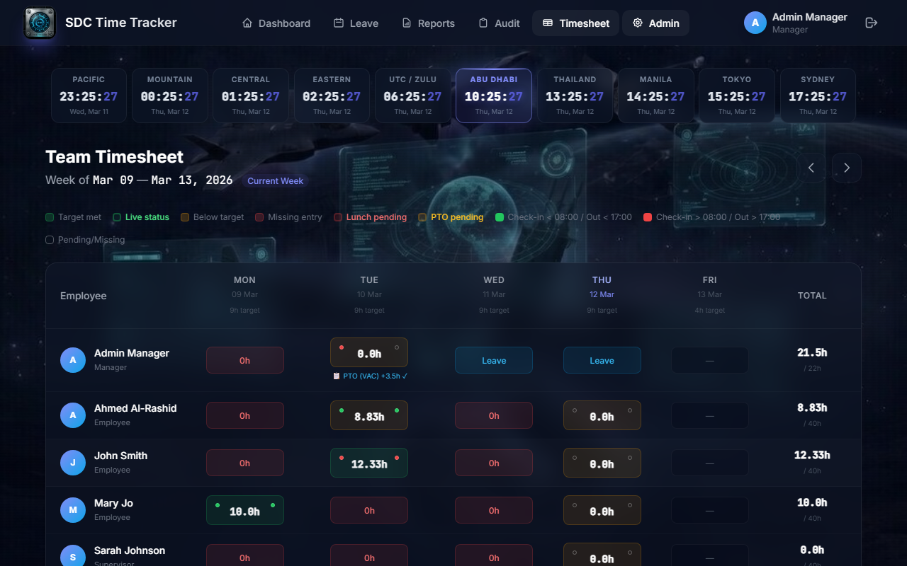

### 2.4 Reports & Audits
Keeping comprehensive records is crucial for an Electronic Time and Attendance System (ETAS). 
- **Reports:** The Reports page allows you to generate PDF or Excel compliance reports for individual employees across a date range. It tracks total hours worked against their mandatory targets.
- **Audits:** The Audit Log securely records every action taken in the system. Check-ins, manual modifications, PTO approvals, and configuration changes are logged with IP addresses, timestamps, and the exact "old value" vs "new value". This ensures total transparency for administrators.

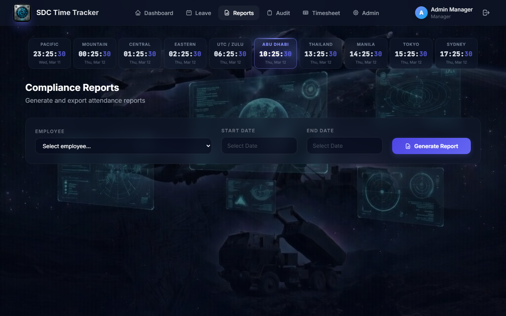
*(Above: Compliance reporting tool)*

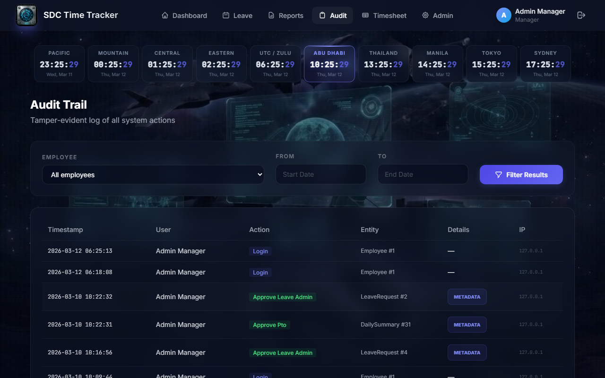
*(Above: Immutable system audit log)*
